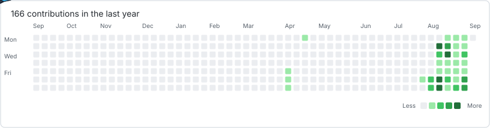

<table width="100%" cellpadding="40" cellspacing="0" bgcolor="#F3EBDD">
<tr>
<td align="center">

# MOHAMMED MAAZ

### `Developer` · `Builder` · `AI & Cloud Engineer`

Building intelligent systems, scalable software, and practical solutions.

 

 
 

</td>
</tr>
</table>

 

<table width="100%" cellpadding="30" cellspacing="0" bgcolor="#F3EBDD">
<tr>
<td>

## `01` — WHO AM I?

I enjoy turning complex ideas into **useful, reliable, and intelligent software**.

</td>
</tr>
</table>

 

<table width="100%" cellpadding="30" cellspacing="0" bgcolor="#F3EBDD">
<tr>
<td>

## `02` — CURRENTLY BUILDING

**AI SYSTEMS**

Building intelligent agents and automation workflows.

 

**CLOUD INFRASTRUCTURE**

Exploring distributed systems and container platforms.

 

**REAL-WORLD PRODUCTS**

Turning public problems into practical software.

</td>
</tr>
</table>

 

<table width="100%" cellpadding="30" cellspacing="0" bgcolor="#F3EBDD">
<tr>
<td>

## `03` — CONTRIBUTIONS

</td>
</tr>
</table>

 

<table width="100%" cellpadding="30" cellspacing="0" bgcolor="#F3EBDD">
<tr>
<td align="center">

## `04` — CONNECT

### Let's build something meaningful.

 

 
 

<code>BUILD • LEARN • SHIP • REPEAT</code>

 
 

© Mohammed Maaz

</td>
</tr>
</table>

