 

### AI Systems · Cloud Infrastructure · Distributed Systems

Building intelligent software and the infrastructure behind it.

---

## About

I'm a software engineer focused on **AI systems, cloud infrastructure, distributed systems, and full-stack engineering**.

I enjoy building systems that combine **intelligence, automation, and reliable infrastructure** — from AI-powered applications to containerized compute platforms and developer tools.

Currently exploring **AI agents, LLM applications, RAG, cloud platforms, and infrastructure automation**.

---

## Technology

---

## Selected Work

### ☁️ Compute Control Plane

**Cloud infrastructure · Container orchestration · Distributed systems**

A Go-based compute management platform for container lifecycle operations, infrastructure state, resource management, and telemetry.

`Go` `Docker` `PostgreSQL` `REST` `Microservices`

**[View Repository →](https://github.com/MohammedMaaz06/compute-control-plane)**

---

### 🧠 HealOps AI

**AI infrastructure operations · Incident intelligence · Automation**

An AI-powered DevOps platform designed to analyze infrastructure incidents, investigate potential root causes, and assist with automated remediation.

`Python` `AI` `DevOps` `Automation`

**[View Repository →](https://github.com/MohammedMaaz06/HealOps-AI)**

---

### 🎯 AI Interview Coach

**LLM applications · Conversational AI · Intelligent evaluation**

An AI-powered interview platform that simulates technical interviews and provides personalized performance analysis and feedback.

`React` `Node.js` `AI` `REST`

**[View Repository →](https://github.com/MohammedMaaz06/Ai-interview-coach)**

---

## Engineering Focus

| Area | Focus |
|---|---|
| **AI Engineering** | LLMs · AI Agents · RAG · Tool Calling · Automation |
| **Cloud Engineering** | Containers · Kubernetes · Infrastructure · Observability |
| **Distributed Systems** | Go · Microservices · APIs · Service Orchestration |
| **Backend Engineering** | Python · Node.js · PostgreSQL · Redis |
| **Product Engineering** | React · Next.js · React Native · Expo |
| **DevOps** | Docker · CI/CD · Linux · GitHub Actions |

---

## GitHub

---

## Currently Building

### AI × Infrastructure

I'm interested in building systems where AI can **understand environments, use tools, make decisions, and automate complex infrastructure workflows.**

---

### Building systems. Automating complexity.

 

[LinkedIn](https://www.linkedin.com/in/mohammed-maaz-6129b2219) · [GitHub](https://github.com/MohammedMaaz06)

